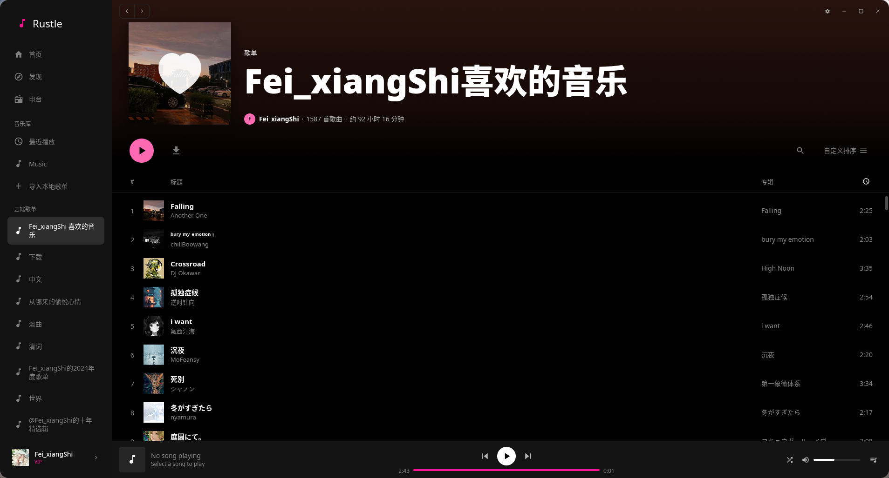
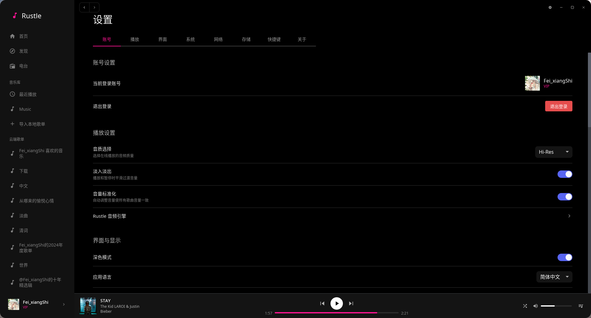

<p align="center">
  
</p>

<h1 align="center">Rustle</h1>

<p align="center">
  <b>一个使用 Rust + iced 构建的现代音乐播放器</b><br>
  支持网易云音乐和本地音乐库
</p>

<p align="center">
  <a href="../../releases"></a>
  
  
</p>

<p align="center">
  <a href="#-安装">安装</a> •
  <a href="#-特性">特性</a> •
  <a href="#-快捷键">快捷键</a> •
  <a href="#-技术栈">技术栈</a>
</p>

---

<p align="center">
  
</p>

<details>
<summary><b>📸 更多截图</b></summary>
<br>
<p align="center">
  
</p>
<p align="center">
  
</p>
</details>

---

## 📦 安装

前往 [Releases](../../releases) 下载对应平台的安装包：

| 平台 | 格式 | 架构 |
|:----:|:----:|:----:|
| Windows | `.exe` | x86_64 |
| macOS | `.dmg` | Intel / Apple Silicon |
| Linux | `.AppImage` | x86_64 |

**Arch Linux (AUR)**

```bash
# 预编译版本
yay -S rustle-bin

# 从源码编译
yay -S rustle
```

<details>
<summary><b>从源码构建</b></summary>

```bash
# 克隆仓库
git clone https://github.com/ArcticFoxNetwork/Rustle
cd Rustle

# 安装依赖 (Ubuntu/Debian)
sudo apt-get install -y libssl-dev libdbus-1-dev libasound2-dev

# 构建并运行
cargo build --release
./target/release/rustle
```
</details>

---

## ✨ 特性

| 🎧 音乐播放 | 🎨 界面设计 |
|:--|:--|
| 网易云音乐在线播放 | 深色/浅色主题 |
| 本地音乐库管理 | Apple Music 风格歌词 |
| 多音质 (128k ~ Hi-Res) | GPU 加速 SDF 渲染 |
| 无缝预加载切换 | Spring 物理动画 |

| 🎼 歌词格式 | 🔊 音频处理 |
|:--|:--|
| LRC / YRC / QRC | 10 段均衡器 |
| TTML / ESLrc / LYS | 实时频谱可视化 |
| 翻译 + 罗马音 | 音量标准化 |

| 🖥️ 系统集成 |
|:--|
| 系统托盘 / MPRIS (Linux) / 全局快捷键 / 代理设置 |

---

## 🎮 快捷键

| 播放控制 | | 导航 | |
|:--|:--|:--|:--|
| `Space` | 播放/暂停 | `Ctrl+H` | 首页 |
| `Ctrl+N/P` | 下/上一首 | `Ctrl+K` | 搜索 |
| `Ctrl+→/←` | 快进/快退 | `Q` | 队列 |
| `Ctrl+↑/↓` | 音量 +/- | `F11` | 全屏 |

---

## 🛠️ 技术栈

[iced](https://github.com/iced-rs/iced) • [rodio](https://github.com/RustAudio/rodio) • [symphonia](https://github.com/pdeljanov/Symphonia) • [wgpu](https://github.com/gfx-rs/wgpu) • [SQLx](https://github.com/launchbadge/sqlx) • [cosmic-text](https://github.com/pop-os/cosmic-text)

---

## 📄 License

[AGPL-3.0](LICENSE)

## 🙏 致谢

- [AMLL](https://github.com/Steve-xmh/applemusic-like-lyrics) - 歌词格式参考
- [NeteaseCloudMusicApi](https://github.com/Binaryify/NeteaseCloudMusicApi) - API 参考
