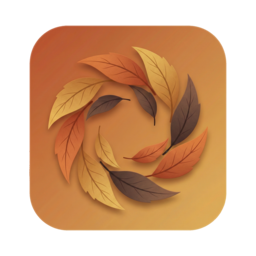
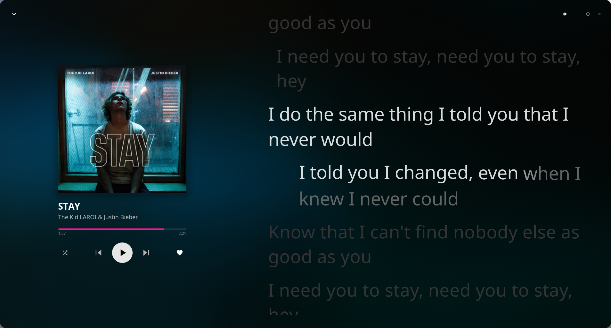
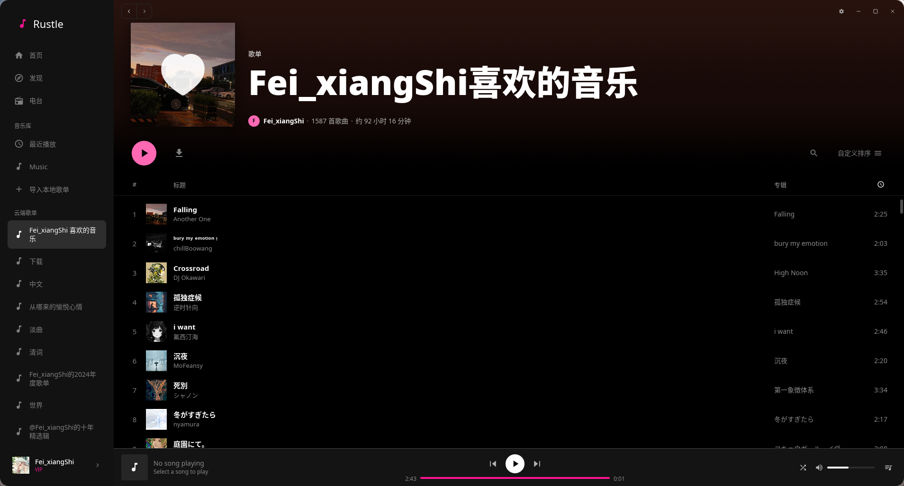
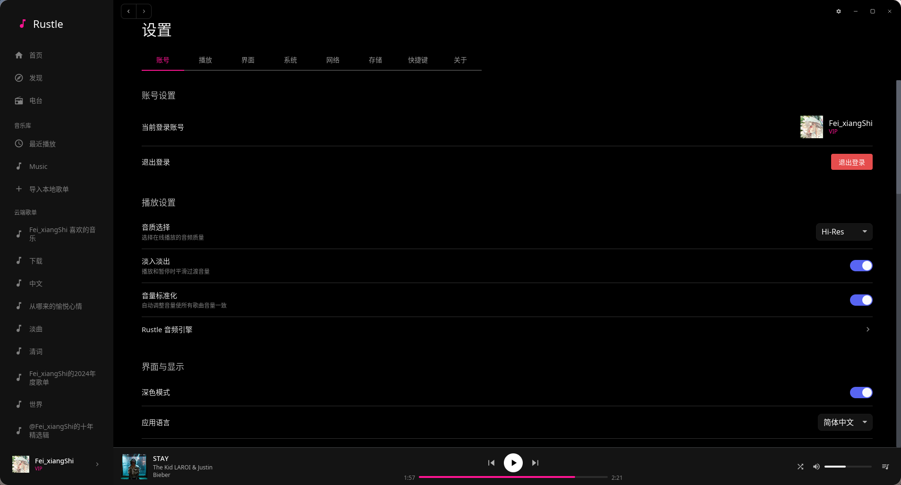

<p align="center">
  
</p>

<h1 align="center">Rustle</h1>

<p align="center">
  <b>纯 Rust 构建的高性能音乐播放器</b><br>
  支持网易云音乐和本地音乐库
</p>

<p align="center">
  <a href="../../releases"></a>
  
  
</p>

<p align="center">
  <a href="#-安装">安装</a> •
  <a href="#-特性">特性</a> •
  <a href="#-快捷键">快捷键</a>
</p>

---

<p align="center">
  
</p>

<details>
<summary><b>📸 更多截图</b></summary>
<br>
<p align="center">
  
</p>
<p align="center">
  
</p>
</details>

---

## 🚀 为什么选择 Rustle

### 对比 Electron 应用

| | Rustle | Electron 播放器 |
|:--|:--:|:--:|
| **内存占用** | ~250MB | 500MB+ |
| **磁盘占用** | ~15MB | 150MB+ |
| **CPU 空闲时** | <1% | 3–5% |
| **启动速度** | 10ms | 2–5秒 |

### 真正的跨平台体验

| 平台 | 系统托盘 | 媒体控制 |
|:--|:--:|:--:|
| **Linux** | StatusNotifierItem | MPRIS2 D-Bus |
| **Windows** | 原生托盘 | 系统媒体控制 |
| **macOS** | 菜单栏图标 | 控制中心集成 |

### 更懂你的使用习惯

- **播放状态持久化** — 关闭后下次打开自动恢复队列与进度
- **无缝预加载** — 提前解码下一首，切歌零等待

### GPU 加速歌词渲染

- **Apple Music 风格** — 逐字高亮、弹簧物理动画
- **SDF 文字渲染** — GPU 加速，任意缩放不模糊
- **多格式支持** — LRC / YRC / QRC / TTML / ESLrc / LYS

---

## 📦 安装

前往 [Releases](../../releases) 下载对应平台的安装包：

| 平台 | 格式 | 架构 |
|:----:|:----:|:----:|
| Windows | `.msi` / `.exe` | x86_64 |
| macOS | `.dmg` | Intel / Apple Silicon |
| Linux | `.AppImage` | x86_64 |

**Windows (winget)**

```bash
winget install FeiXiangShi.Rustle
```

**Arch Linux (AUR)**

```bash
# 预编译版本
yay -S rustle-bin

# 从源码编译
yay -S rustle
```

<details>
<summary><b>从源码构建</b></summary>

```bash
git clone https://github.com/Fei-xiangShi/Rustle
cd Rustle

# Ubuntu/Debian
sudo apt-get install -y libasound2-dev pkg-config
# Arch
sudo pacman -S --needed alsa-lib pkgconf

cargo build --release --locked
./target/release/rustle
```

Windows / macOS 安装好 [Rust 工具链](https://rustup.rs) 后直接 `cargo build --release` 即可；Windows 本地构建未生成临时 ICO 时不保证 EXE 带 PE 文件图标，正式 Release 由 CI 负责生成。
</details>

---

## ✨ 特性

| 🎧 音乐播放 | 🎨 界面设计 |
|:--|:--|
| 网易云音乐在线播放 | 深色/浅色主题 |
| 本地音乐库管理 | Apple Music 风格歌词 |
| 多音质 (128k ~ Hi-Res) | GPU 加速 SDF 渲染 |
| 无缝预加载切换 | Spring 物理动画 |

| 🎼 歌词格式 | 🔊 音频处理 |
|:--|:--|
| LRC / YRC / QRC | 10 段均衡器 |
| TTML / ESLrc / LYS | 实时频谱可视化 |
| 翻译 + 罗马音 | 音量标准化 |

| 🖥️ 系统集成 |
|:--|
| 系统托盘 · MPRIS2 (Linux) · 全局媒体键 · 代理设置 |

---

## 🎮 快捷键

| 播放控制 | | 导航 | |
|:--|:--|:--|:--|
| `Space` | 播放 / 暂停 | `Ctrl+H` | 首页 |
| `Ctrl+N` / `Ctrl+P` | 下 / 上一首 | `Ctrl+K` | 搜索 |
| `Ctrl+→` / `Ctrl+←` | 快进 / 快退 | `Q` | 队列 |
| `Ctrl+↑` / `Ctrl+↓` | 音量 +/− | `F11` | 全屏 |

---

## 🛠️ 技术栈

[iced](https://github.com/iced-rs/iced) • [rodio](https://github.com/RustAudio/rodio) • [symphonia](https://github.com/pdeljanov/Symphonia) • [wgpu](https://github.com/gfx-rs/wgpu) • [SQLx](https://github.com/launchbadge/sqlx) • [cosmic-text](https://github.com/pop-os/cosmic-text)

---

## 📄 License

[AGPL-3.0](LICENSE)

## 🙏 致谢

- [AMLL](https://github.com/Steve-xmh/applemusic-like-lyrics) - 歌词格式参考
- [ncm-api-rs](https://github.com/SPlayer-Dev/ncm-api-rs) - 网易云音乐 API SDK
